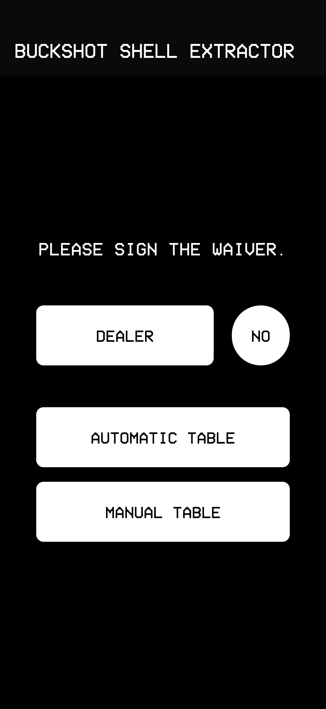
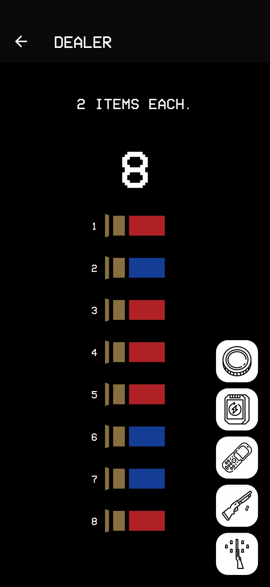
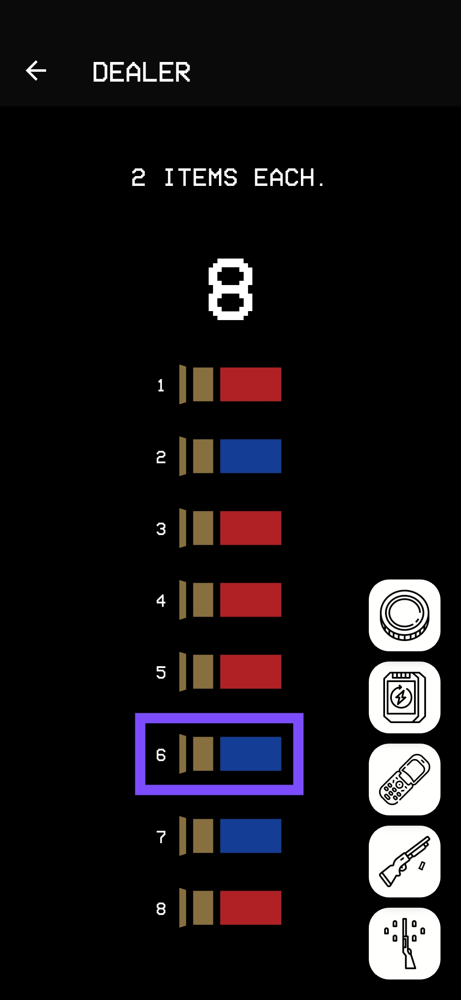
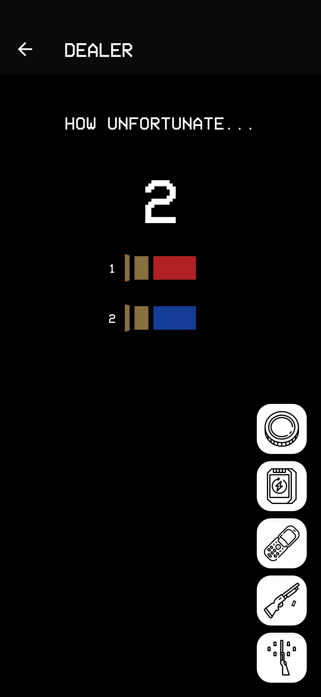
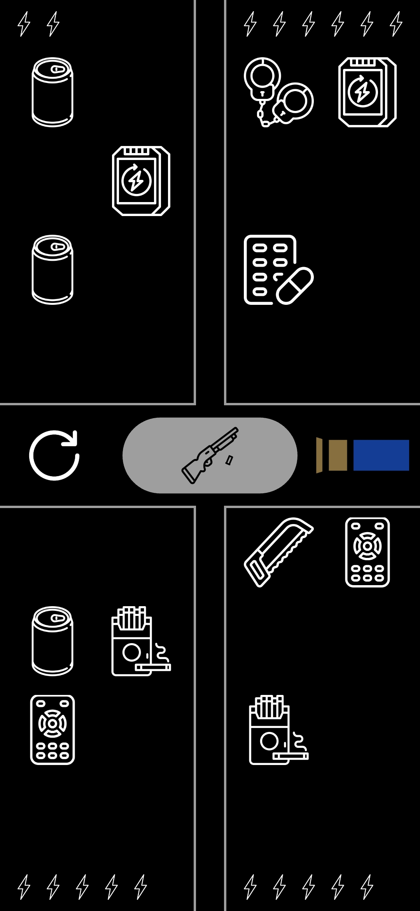
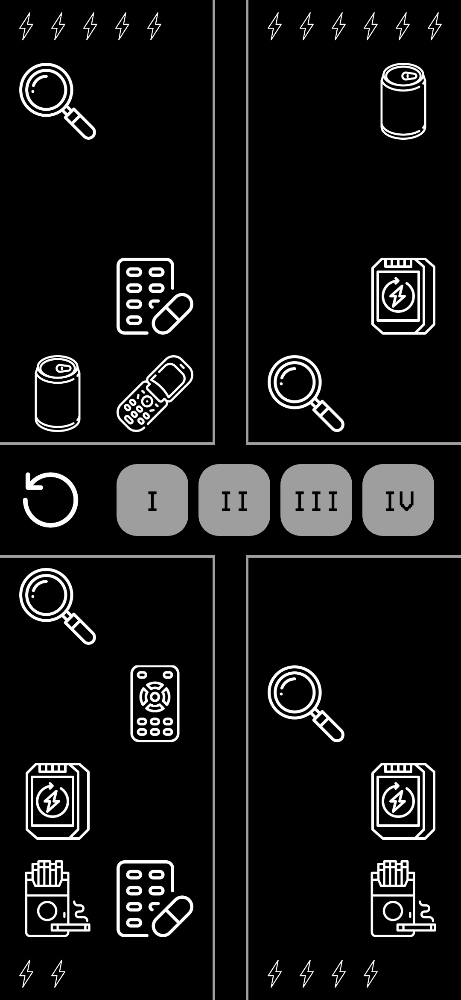
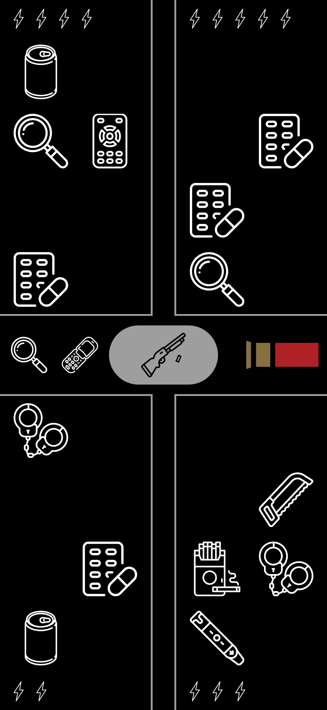
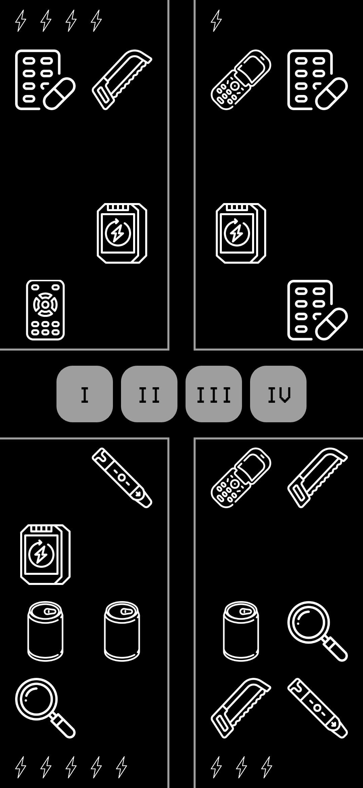
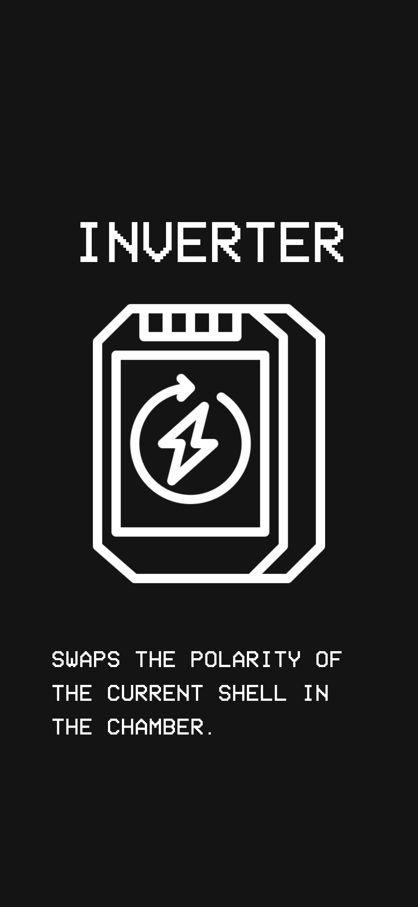

# Buckshot Shell Extractor

An app that randomises shell number, type and order -exactly like in the game Buckshot Roulette- to play with friends in real life (with a fake gun, obviously).
It can also simulate drawing items, using them and it can also keep track of player charges (health points).

Read THIRD-PARTY-NOTICES.md for third-party assets attributions.

## Examples

### Homepage

### Dealer Page

#### Reload

#### Burner Phone

#### Burner Phone with two shells or less...

### Items Screen

#### Automatic table with internal dealer

#### Automatic table with external dealer

#### Manual table with internal dealer

#### Manual table with external dealer

#### Item description

