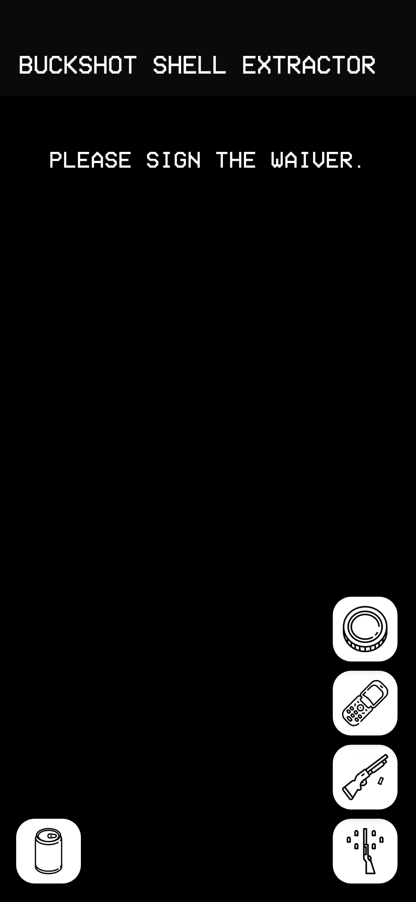
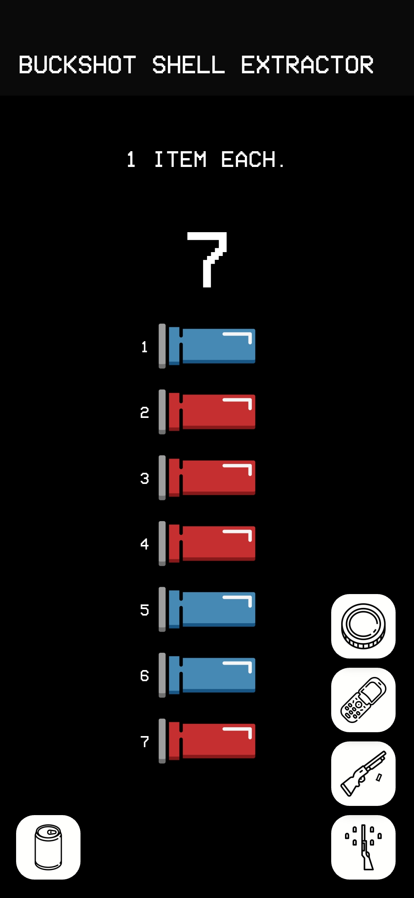
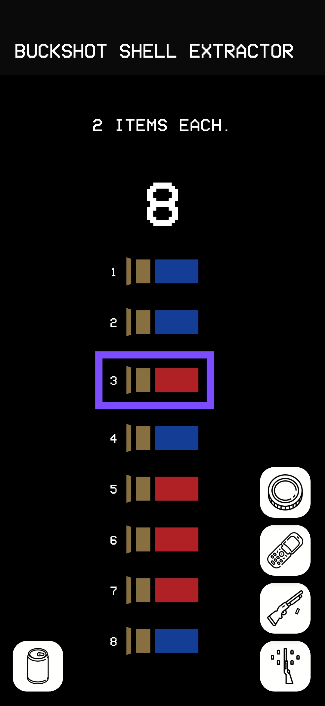
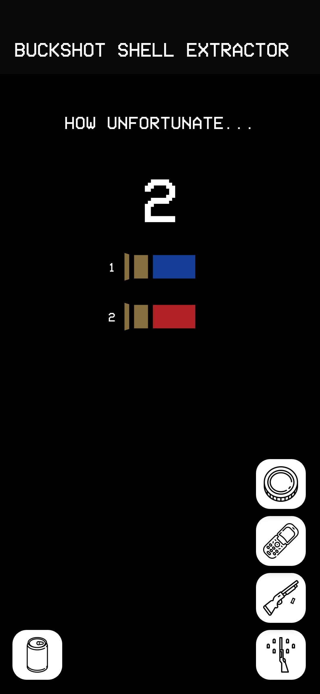
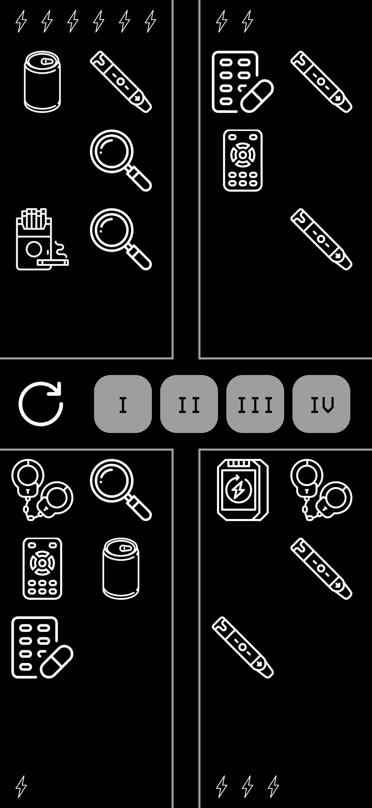

# Buckshot Shell Extractor

An app that randomises shell number, type and order -exactly like in the game Buckshot Roulette- to play with friends in real life (with a fake gun, obviously).
It can also simulate drwaing items, using them and it can also keep track of player charges (health points).

Read THIRD-PARTY-NOTICES.md for third-party assets attributions.

## Examples
### First Page

### Reload

### Burner Phone
#### Burner Phone prediction

### Burner Phone with two shells or less...

### Items Screen

