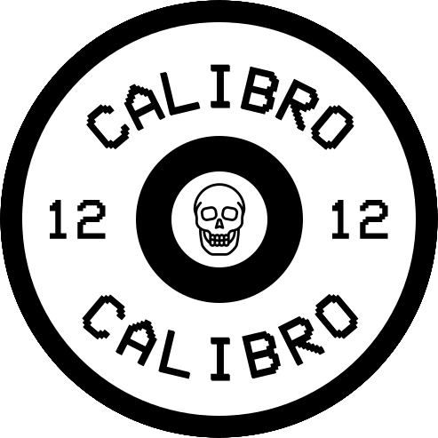
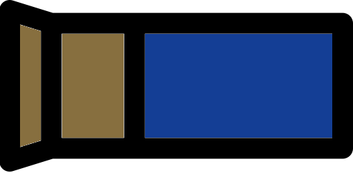

## Third-party resources used

Written using Flutter and Dart https://flutter.dev/.

### App Icon

 the skull in the center is
<a href="https://www.flaticon.com/free-icons/skull" title="skull icons">Skull icons created by MYS Design - Flaticon</a>

### Shotgun shell design

 are recolored versions of
<a href="https://www.flaticon.com/free-icons/ammunition" title="ammunition icons">Ammunition icons created by Smashicons - Flaticon</a>

### Home Page Buttons

<a href="https://www.flaticon.com/free-icons/flip-phone" title="flip phone icons">Flip phone icons created by Freepik - Flaticon</a>

is a merged version of this two icons:
<a href="https://www.flaticon.com/free-icons/shotgun" title="shotgun icons">Shotgun icons created by Nikita Golubev - Flaticon</a>,
<a href="https://www.flaticon.com/free-icons/shotgun" title="shotgun icons">Shotgun icons created by juicy_fish - Flaticon</a>

<a href="https://www.flaticon.com/free-icons/shotgun" title="shotgun icons">Shotgun icons created by POD Gladiator - Flaticon</a>

<a href="https://www.flaticon.com/free-icons/coin" title="coin icons">Coin icons created by turkkub - Flaticon</a>

### Items

<a href="https://www.flaticon.com/free-icons/inverter" title="inverter icons">Inverter icons created by Vichanon Chaimsuk - Flaticon</a>

<a href="https://www.flaticon.com/free-icons/beer-can" title="beer can icons">Beer can icons created by Freepik - Flaticon</a>

<a href="https://www.flaticon.com/free-icons/cigarette" title="cigarette icons">Cigarette icons created by Good Ware - Flaticon</a>

<a href="https://www.flaticon.com/free-icons/epipen" title="epipen icons">Epipen icons created by Smashicons - Flaticon</a>

<a href="https://www.flaticon.com/free-icons/flip-phone" title="flip phone icons">Flip phone icons created by Freepik - Flaticon</a>

<a href="https://www.flaticon.com/free-icons/hacksaw" title="hacksaw icons">Hacksaw icons created by juicy_fish - Flaticon</a>

<a href="https://www.flaticon.com/free-icons/handcuffs" title="handcuffs icons">Handcuffs icons created by Georgy - Flaticon</a>

<a href="https://www.flaticon.com/free-icons/blister" title="blister icons">Blister icons created by Pixel perfect - Flaticon</a>

<a href="https://www.flaticon.com/free-icons/search" title="search icons">Search icons created by Freepik - Flaticon</a>

<a href="https://www.flaticon.com/free-icons/remote-control" title="remote control icons">Remote control icons created by nawicon - Flaticon</a>

<a href="https://www.flaticon.com/free-icons/lightning" title="lightning icons">Lightning icons created by Fazrian Zahrawani - Flaticon</a>

<a href="https://www.flaticon.com/free-icons/refresh" title="refresh icons">Refresh icons created by Vectors Market - Flaticon</a>

### Fonts

Font used: `VCR OSD Mono`
https://www.dafont.com/vcr-osd-mono.font
